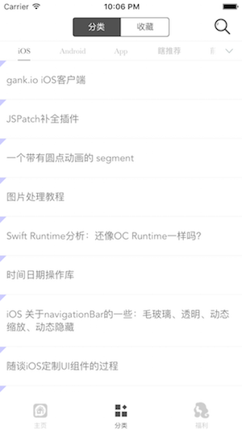
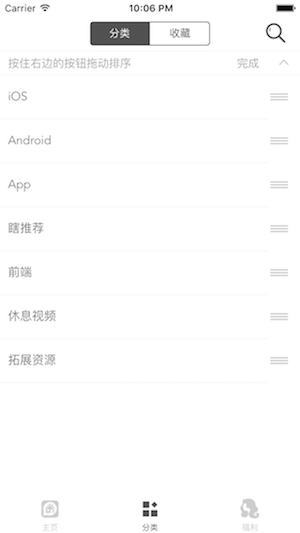
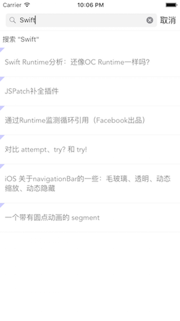
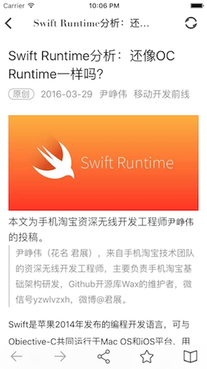
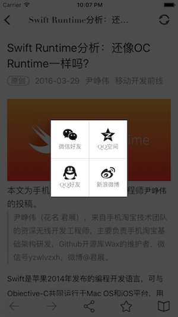
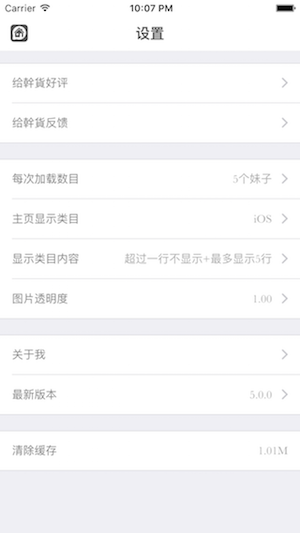

# GanHuoCode
此项目为干货集中营的第三方iOS客户端，已在AppStore上架：[幹貨－IT技术分享平台](https://appsto.re/cn/dc-A_.i) 
数据来自代码家的干货网站：[http://gank.io](http://gank.io) 
如果想要安卓客户端，请点：[Meizhi](https://github.com/drakeet/Meizhi) 
可以通过扫描以下二维码进行下载： 
 

TODO：

  - UI TEST  (**)
  - etc 
  
DISCARD:

  - ~~Support 8.0+~~
 
DONE:

  - SDWebImage－》Kingfisher  (***** waiting version 2.0.0)
  - Cache (*** archive)
  - Favorites (***local)
  - CoreData+ ~~icloud~~(***)
  
  
<!--App切图： -->
<!---->
<!---->
<!---->
<!---->
<!---->
<!---->
<!---->
<!---->
<!---->
<!---->

